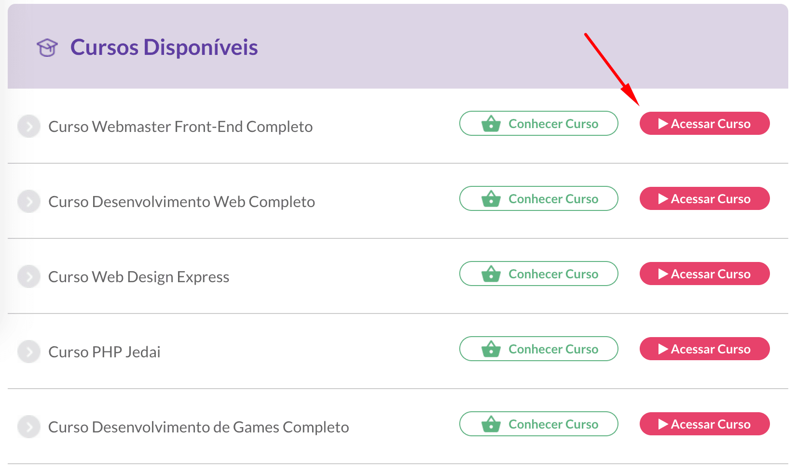
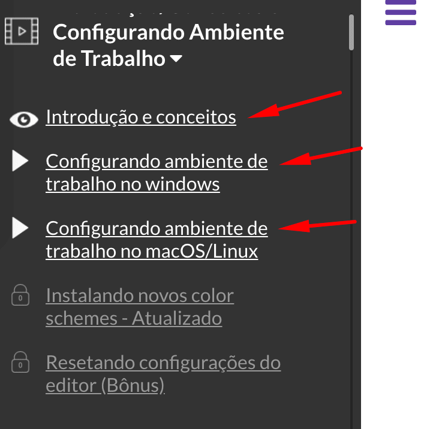

Neste post vou mostrar como ter acesso a **aulas gratuitas** do curso **[Pacote Full-Stack](/pacote-full-stack/postwddgratis)**, diretamente da plataforma de cursos da **Danki Code**.

## O que é o Pacote Full-Stack?

**O Pacote Full-Stack da Danki Code é um pacote de cursos que engloba toda a formação de Desenvolvedor Web, incluindo backend, frontend e web design.**

Veja mais detalhes no post [Curso Pacote Full-Stack Danki Code é bom? Vale a pena?](/curso-pacote-full-stack-danki-code-bom-vale-pena/)

## Como acessar as aulas grátis do Pacote Full-Stack da Danki Code?

1. Faça um cadastro gratuito na plataforma de cursos da **Danki Code** através do link abaixo:

[→ Plataforma de cursos Danki Code - Cadastro](/aulas-danki-code/postwdd)

2. Após o login na plataforma, você vai ver uma área de **Cursos Disponíveis**. Lá tem todos os cursos do **Pacote Full-Stack** e também de outros cursos da Danki. 

3. Clique em **Acessar Curso** ao lado do curso desejado.  
Veja a imagem:

4. Dentro do curso veja as aulas com o link habilitado (sem o cadeado). São as aulas grátis liberadas para você acessar.  
Veja a imagem:

Faça bom proveito. 😉
