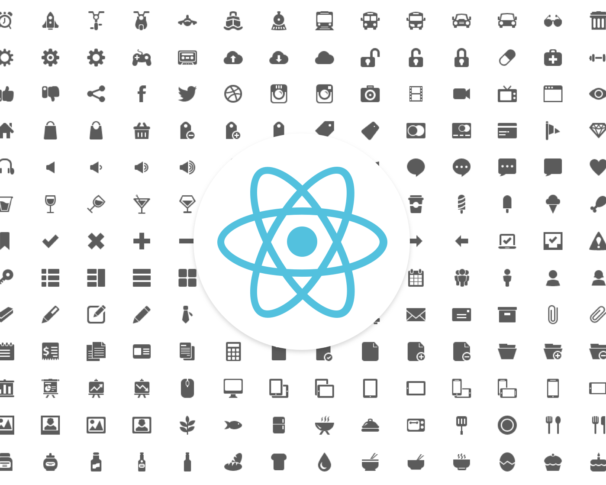

After coming from PNG sprites and then icon fonts to display icons in my projects, and suffering the problems and limitations of those approaches, in my most recent project I finally tried to use a more suitable format: SVGs!

## How the component should work

The goal is to simply pass the icon name as a prop and have the SVG rendered on the page, like this:

<Icon name="camera" />

Icon on the page.

## Creating the component

The `Icon` component is a functional stateless component that render some SVG markup:

A few things to notice:

*   It imports an SVG file directly in the JS file. I’ll show below how to configure Webpack to make this work.
*   The rendered SVG code is just a reference to the actual icon data, that is stored in the `icons.svg` file, using `xlink:href` (or `xlinkHref` to make compatible with JSX).
*   The resulting tag will have a CSS class according to the icon name, `icon-camera` for instance, for easier styling.

## Creating the SVG file

The `icons.svg` file looks like this:

<svg version="1.1" xmlns="http://www.w3.org/2000/svg">  
  <defs>  
    <symbol id="home" viewBox="0 0 32 32">  
      <path d="M32 19l-6-..."></path>  
    </symbol>  
    <symbol id="camera" viewBox="0 0 32 32">  
      <path  
        d="M9.5 19c0..."></path>  
    </symbol>  
    <symbol id="headphones" viewBox="0 0 32 32">  
      <path d="M9 18h-2v..."></path>  
      <path d="M23 18c-0.55..."></path>  
      </symbol>  
  </defs>  
</svg>

This is the actual SVG data to draw the icons. It uses `symbol` tags to make the shapes reusable. For instance, `<use xlink:href="#camera"></use>` will take contents of the `symbol` with `id="camera"` and replicate it.

An easy way to create this file is with the [IcoMoon app](https://icomoon.io/app). You select the icons from various icon packs and download a custom pack that includes a `symbol-defs.svg` with the selected icons in the format we need.

You can also create and export your own icons using a vector drawing software like, Sketch, Illustrator or Inkscape.

## Setup SVG Sprite Loader

In order for the `xlink:href` find the SVG data, the contents of the `icons.svg` file must be injected inside the body of the page. To make this happen, we will use the Webpack loader [svg-sprite-loader](https://github.com/kisenka/svg-sprite-loader).

**Note:** `xlink:href` can also work with external SVG files, like this: `xlink:href="icons.svg#camera"`, but as [this post by Chris Coyer](https://css-tricks.com/svg-use-with-external-reference-take-2/) points out, it has some drawbacks and compatibility issues with older browsers, so we’ll go the safest route.

To use the svg-sprite-loader, just install it (`npm i -D svg-sprite-loader`) and add to your Webpack config, inside `module.rules`:

{  
  test: /\\.svg$/,  
  loader: 'svg-sprite-loader'  
}

With this default config, the loader will intercept imported SVG files, like the `import './icons.svg’` in our component, and inject the contents on top of the page body. It will add the name of the file as a prefix to the symbol ids, so `<symbol id="camera">` in our original `icons.svg` file, becomes `<symbol id="icons_camera">`. That’s why our component has ``xlinkHref={`#icons_${props.name}`}``.

The complete code can be found here: [https://github.com/doug2k1/react-svg-icon](https://github.com/doug2k1/react-svg-icon)

I hope this can be useful. Let me know if you have any suggestions.