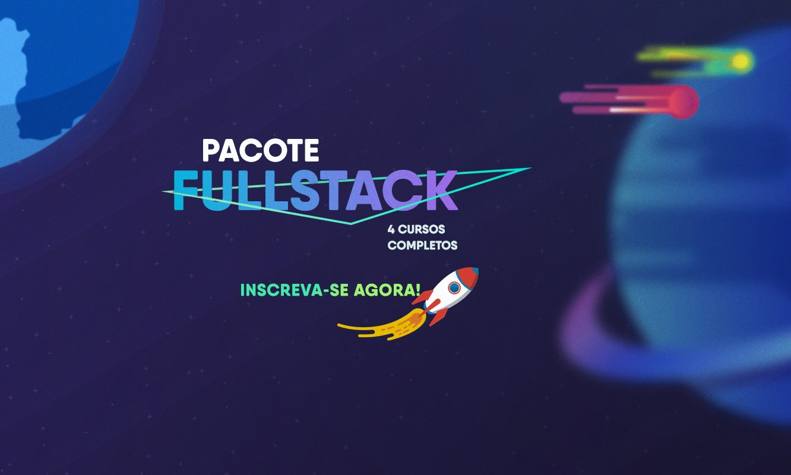

Muita gente está me perguntando se o curso [Pacote Full-Stack](/pacote-full-stack/postwdd) da **Danki Code** é bom mesmo. Será que vale a pena?

Veja minha análise completa neste post.

## O que é o Pacote Full-Stack?

**O curso Pacote Full-Stack da Danki Code é, na verdade um pacote de cursos que engloba toda a formação de Desenvolvedor Web, incluindo backend, frontend e web design.**

## Conteúdo

O pacote, que vai desde o iniciante até o avançado, é composto pelos cursos:

✅ **Front-End Completo**: vai desde os conceitos básicos, HTML, CSS, design responsivo, JavaScript e lógica de programação, frameworks JS, ES6, Sass, Less.

✅ **Desenvolvimento Web Completo**: este é focado no backend em PHP. Vai desde configuração do servidor, hospedagem, lógica de programação e algoritmos, banco de dados, SEO, analytics, MVC, segurança e muito mais.

✅ **Web Design Express**: focado em design, Photoshop, UI, UX.

✅ **PHP Jedai**: aqui vem a parte mais avançada de PHP, incluíndo PHP 7+ e projetos mais desafiadores.

✅ Além de outros **bônus** para complementar o aprendizado.

Você pode conferir mais detalhes das grades do cursos e dos bônus visitando o [site oficial aqui](/pacote-full-stack/postwdd).

## Atualizações vitalícias

Os cursos são **atualizados frequentemente** para cobrir novas tecnologias. E o melhor de tudo é que você paga uma vez e tem **acesso vitalício**, incluindo todas as futuras atualizações.

## Projetos desenvolvidos

Um grande diferencial do pacote é que ele une bem teoria e prática. Durante os cursos você irá desenvolver **mais de 100 projetos práticos**, o que reforça o aprendizado e já constrói um respeitável portfólio de projetos para atrair clientes (caso queira ser um freelancer) e recrutadores (caso queira seguir carreira em empresas).

## Garantia

A Danki Code oferece uma grantia de **30 dias**. Se não gostar do curso, por qualquer motivo, eles devolvem 100% do valor pago.

## Preço

Com todo esse conteúdo, bônus, atualizações, e o quanto ele vai transformar sua carreira de desenvolvedor web full-stack, o preço é irrisório. Atualmente sai a **menos de R$ 1,30 por dia!** 

O primeiro projeto que você pegar como freelancer ou o próximo emprego que você conseguir com essas habilidades já paga o curso com folga!

⚠️ **Atenção!** O pessoal da **Danki Code** está para aumentar o preço em breve devido a tantas atualizações! Recomendo ir lá no [site oficial](/pacote-full-stack/postwdd) e garantir logo sua vaga com o preço atual.

## Conclusão

A **Danki Code** é referência em cursos de TI, possui atualmente mais de 25.000 alunos matriculados e tem nota máxima nas plataformas de cursos online.

Um curso **bem estruturado** faz muita diferença na sua carreira. Muitos desenvolvedores ficam "correndo atrás do rabo", buscando conteúdos gratuitos fragmentados e, muitas vezes, de qualidade duvidosa, e acabam estagnados e frustrados.

O [Pacote Full-Stack](/pacote-full-stack/postwdd) é um excelente investimento atualmente, tanto para quem quer começar quanto para o profissional que quer dar um upgrade na carreira de **desenvolvedor web**.

🔥 **Atualização**:   
A Danki Code liberou algumas **aulas grátis** do **Pacote Full-Stack**!  
Veja como acessar no post: [Aulas Grátis do Curso Pacote Full-Stack da Danki Code](/aulas-gratis-curso-pacote-full-stack-danki-code/)

