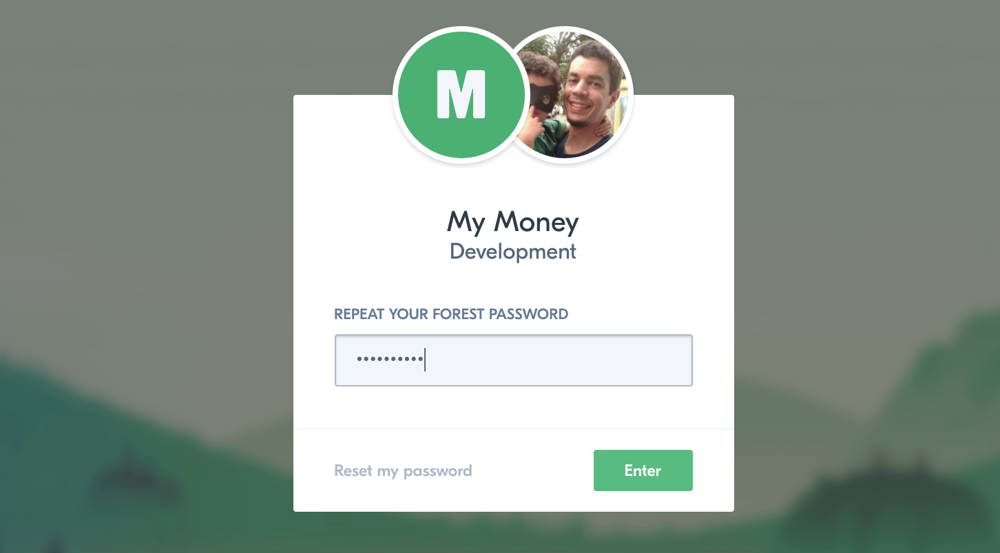
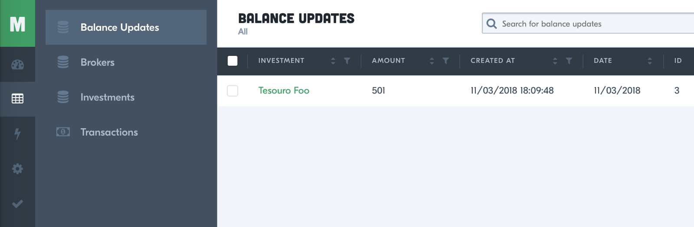
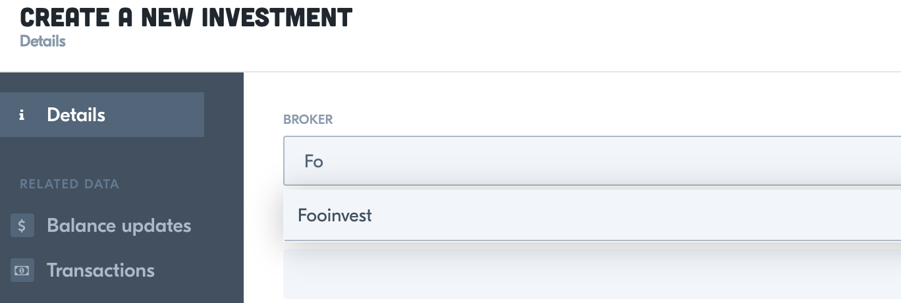
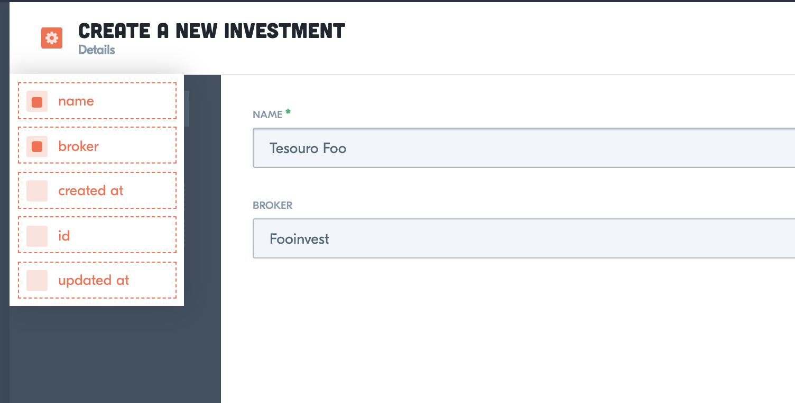
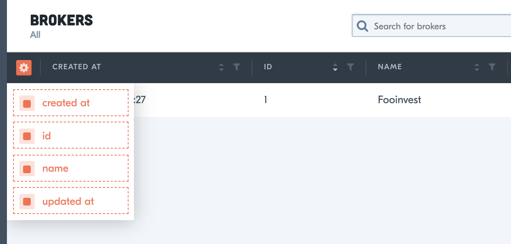
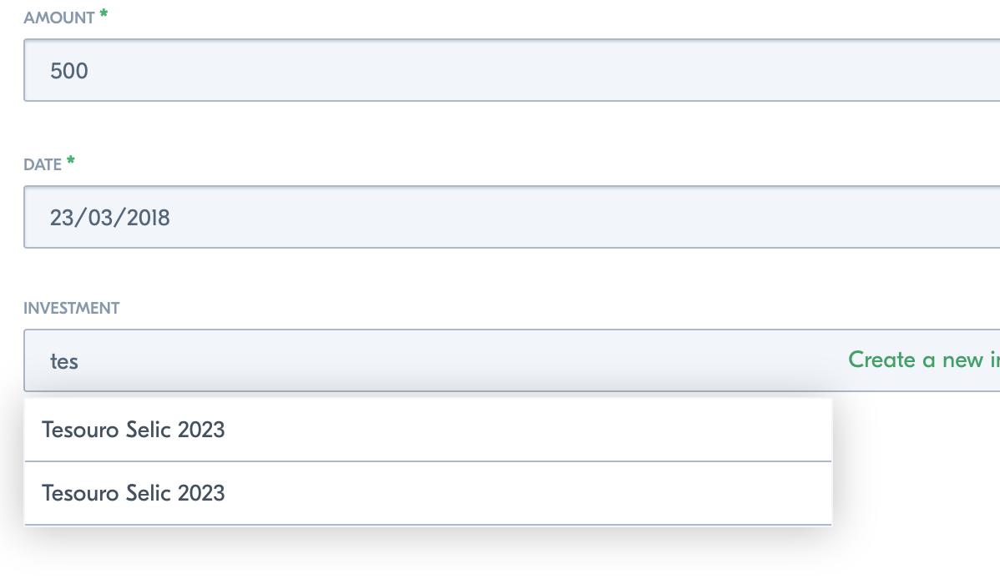
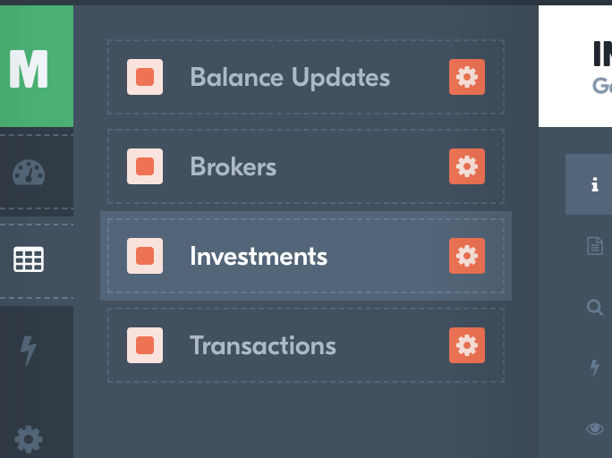
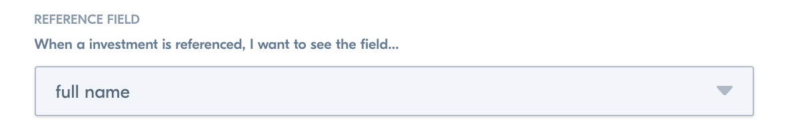
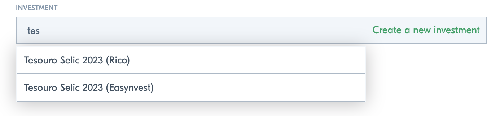

Faaala, pessoal! Neste quarto post da série [**Fullstack com Node.js, React e GraphQL**](./fullstack-node-react-graphql-introducao-2c2f18c757c4) vamos criar a interface administrativa usando [**Forest Admin**](https://www.forestadmin.com/), permitindo fazer o CRUD dos dados (criar, editar, visualizar e remover).


## Forest Admin

[**Forest Admin**](https://www.forestadmin.com/) é um serviço que cria uma interface administrativa a partir dos dados (modelos) da sua aplicação. Esta interface fica hospedada nos servidores da **Forest** e se comunica com a sua aplicação através de uma API REST, também gerada pelo **Forest Admin**.

O serviço é gratuito, mas possui um plano pago com funcionalidades mais avançadas. Vamos usar o plano gratuito mesmo.

### Instalação e configuração

Instale a dependência:

```bash
npm i forest-express-sequelize
```

Este é o módulo específico para **Node** com **Sequelize**. O **Forest** possui integração com várias stacks.

No _src/index.js_ vamos habilitar o **middleware** que gera a API REST que será usada na área administrativa.

> **Middlewares** no Express são funções que interceptam as requisições e as respostas, podendo modificá-las ou executar algum código auxiliar.

No topo, importe o módulo do **Forest**, a instância do **Sequelize** e também o arquivo de dados secretos, pois vamos precisar:

```js
const ForestAdmin = require('forest-express-sequelize');  
const { sequelize } = require('./models');  
const secret = require('../config/secret');
```

E após instanciação do app, `const app = express()`, adicione:

```js
app.use(  
  ForestAdmin.init({  
    modelsDir: path.resolve('./src/models'),  
    envSecret: secret.FOREST_ENV_SECRET,  
    authSecret: secret.FOREST_AUTH_SECRET,  
    sequelize  
  })  
);
```

Ao habilitar o middleware do **Forest**, ele vai criar um conjunto de rotas a partir do caminho _/forest_ na sua aplicação, gerando assim a API que a interface administrativa vai usar.

Veja que ele pede o caminho da pasta de modelos, pois ele vai analisá-los para gerar os formulários e listagens na interface administrativa.

Ele pede também dois códigos para identificar sua aplicação: `envSecret` e `authSecret`. Vamos adicioná-los ao arquivo de dados secretos, mas antes precisamos obtê-los.

### Cadastro no Forest Admin

O processo de cadastro é bem simples, basta acessar [https://www.forestadmin.com](https://www.forestadmin.com/), colocar seu e-mail e clicar em **_Get Started for Free_**.

Depois vai perguntar se você é **_Business_** ou **_Developer_**. Escolha **_Developer_**. E vai perguntar qual é a sua stack (**_Choose your stack_**). Escolha **_Express/Sequelize._**

Ele vai mostrar instruções para instalação. A maior parte nós já fizemos. Apenas precisamos dos códigos `FOREST_ENV_SECRET` e `FOREST_AUTH_SECRET`. Copie-os e cole no arquivo _config/secret.js_:

```js
module.exports = {  
  DATABASE_PASSWORD: '654321',  
  FOREST_ENV_SECRET: 'i9as8fy9safhsauh9saufhs9a8f',  
  FOREST_AUTH_SECRET: 'fy98y39ugsufsiufge9' 
};
```

Aproveite e execute a aplicação: `npm start`.

De volta á página de cadastro do Forest, altera o campo com a URL da aplicação para **http://localhost:5000**, que é onde a nossa está rodando, e clique em **_Verify_**.

Se estiver tudo certo, você vai ver a mensagem: **_Installation success!_**

Você pode dar um nome para a sua aplicação e clicar **_Start_**. Ele vai pedir mais alguns dados e te levar para a tela de entrada da sua área administrativa (ele vai pedir a senha mais uma vez).



Veja abaixo do nome que você está no ambiente **Development**. O Forest permite separar a área administrativa de desenvolvimento da de produção. Assim podemos testar funcionalidades sem mexer nos dados de produção.



Veja no menu **_Data_** que temos páginas de listagem, criação, edição para cada um de nossos modelos.

### Modelos relacionados

Uma _feature_ muito legal é na hora de cadastrar modelos relacionados. Por exemplo, para criar um **investimento** precisamos informar a qual **corretora** ele pertence. O Forest entende a relação e oferece um campo com auto-complete para selecionar a corretora:



### Customizações

O Forest permite várias customizações na interface através da opção **_Layout Editor_** na parte de baixo do menu.

Você pode remover e ordenar campos dos formulários (os campos _id_, _created at_ e _updated at_, por exemplo, são preenchidos automaticamente e não precisamos deles nos formulários).



Deixando o formulário mais clean.

Você também pode ordenar e remover colunas das listagens e alterar o tamanho da paginação.



Customizando a listagem

### Smart fields

O Forest possui uma _feature_ chamada **Smart Fields**, onde você pode adicionar campos adicionais ao seus modelos, e que vai resolver um problema nosso.

É normal ter o mesmo investimento em diferentes corretoras. Posso ter um valor aplicado no **Tesouro Selic 2023** nas corretoras **Easynvest** e **Rico**, por exemplo. No nosso admin, se eu for tentar adicionar uma transação no Tesouro Selic 2023 da Rico, o auto-complete do campo de investimento vai ficar assim:



E aí? Qual é o da Rico e qual é da Easynvest?

Vamos adicionar um campo **Full Name** no investimento, que traz o nome do investimento junto com o da corretora. Para isso basta criar o arquivo _forest/investment.js_:

```js
const ForestAdmin = require('forest-express-sequelize');

ForestAdmin.collection('Investment', {  
  fields: [  
    {  
      field: 'fullName',  
      type: 'String',  
      get(object) {  
        return `${object.name} (${object.Broker.name})`;  
      }  
    }  
  ]  
});
```

Precisamos dizer ao Forest para usar este campo no auto-complete. Ative o **_Layout Editor_** e clique na engrenagem ao lado de **Investments**:



E na opção **_reference field_**, esolher “full name”:



Com isso, sempre que o modelo de **investimento** for referenciado em alguma parte da aplicação, você vai ver o **full name**. Assim podemos identificar a qual corretora pertence:



## Resultado final

O código do projeto até este ponto está em: [https://github.com/doug2k1/my-money/tree/v4.1.0](https://github.com/doug2k1/my-money/tree/v4.1.0)

## No próximo capítulo

Na próxima parte vamos configurar Integração Contínua com  [**Travis CI**](https://travis-ci.org/).

_Stay tuned!_

## Feedbacks?

E aí, o que está achando até agora? Algo que precisa melhorar?

\[\]’s