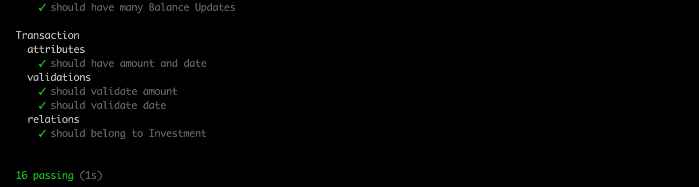
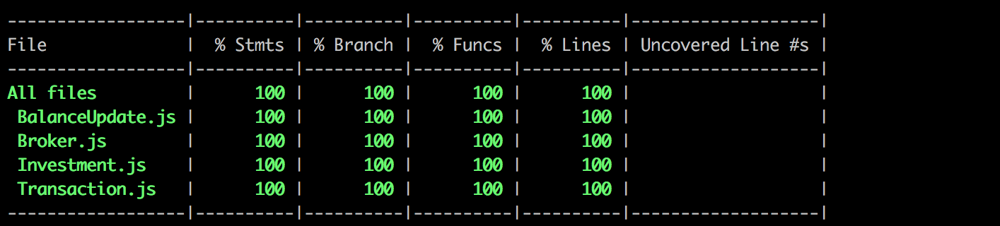
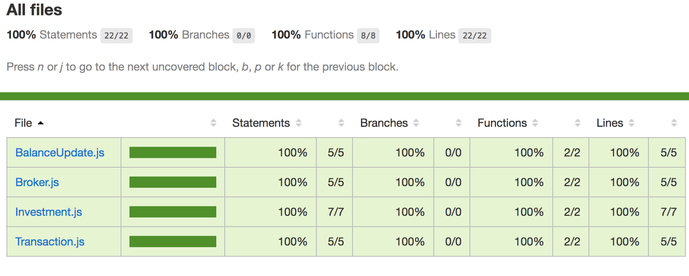

Fala aí, pessoal! Nesta segunda parte do terceiro post da série [**Fullstack com Node.js, React e GraphQL**](./fullstack-node-react-graphql-introducao-2c2f18c757c4) vamos adicionar testes unitários aos nossos modelos do [**Sequelize**](http://docs.sequelizejs.com/).


## Introdução

Estava escrevendo a quarta parte da série, quando a Polícia do **TDD** bateu na minha porta, dizendo que ia cassar meu alvará de desenvolvedor porque estava escrevendo código sem testes!

Até agora a gente escreveu pouco código da aplicação de fato (a maior parte foi setup de ferramentas e bibliotecas, que confiamos que já foram testadas), mas esse pouco já uma parte importante, que são os modelos.

Os modelos poderia ser testados indiretamente, em testes de integração e end-do-end, mas para garantir uma melhor cobertura e ainda aprender algumas coisas novas (pelo menos pra mim), vamos adicionar testes unitários pra eles.

## Ferramentas

Para os nossos testes de backend vamos usar [**Mocha**](https://mochajs.org/), [**Chai**](http://www.chaijs.com/) e [**Istanbul**](https://istanbul.js.org/). Vamos instalar as seguintes dependências:

```bash
npm i -D mocha chai chai-as-promised nyc cross-env
```

[**Mocha**](https://mochajs.org/) é o framework de testes e também o executável que vai rodar os testes e apresentar o resultado.

[**Chai**](http://www.chaijs.com/) é a biblioteca de asserções (o Mocha não inclui uma), que permite usar três sintaxes distintas:

```js
const result = sum(1, 2);

// assert  
assert.equal(result, 3);

// should  
result.should.equal(3);

// expect  
expect(result).to.equal(3);
```

Vamos usar aqui o formato **expect**, simplesmente por gosto pessoal (acho que fica melhor de ler).

[**Chai as Promised**](https://github.com/domenic/chai-as-promised) é uma extensão para o Chai, que adiciona asserções sobre **Promises**. Ex.:

```js
// espera que a promise seja resolvida  
expect(operacaoQueRetornaPromise()).to.be.fulfilled;

// espera que a promise seja rejeitada  
expect(operacaoQueRetornaPromise()).to.be.rejected;

// pega uma valor depois que a promise for resolvida  
expect(operacaoQueRetornaPromise()).to.eventually.equal(3)
```

[**nyc**](https://github.com/istanbuljs/nyc) é o executável do [**Istanbul**](https://istanbul.js.org/), que será usado para medir a cobertura dos nossos testes. (Sim, é NYC de _New York City_)

Por fim, o [**cross-env**](https://www.npmjs.com/package/cross-env), que é um comando para setar variável de ambiente de forma multi-plataforma. Mais embaixo você vai ver porque precisamos disto.

## Banco de testes

Nossos testes vão usar o banco de dados para salvar os modelos criados durante o teste. Precisamos então configurar o ambiente **test** no _config/database.js_, bem parecido com o banco de desenvolvimento:

```js
test: {  
  username: 'mymoney',  
  password: secret.DATABASE_PASSWORD,  
  database: 'mymoney_test',  
  host: '127.0.0.1',  
  dialect: 'postgres',  
  logging: false  
}
```

Ambos são bancos locais, com a diferença no nome do banco, `mymoney_test` e na opção `logging: false`, para desativar os logs de SQL no terminal e não poluir a saída do resultado de testes.

Para criar o banco, usamos:

```bash
npx cross-env NODE_ENV=test sequelize db:create
```

Aqui precisamos setar a variável de ambiente `NODE_ENV` com o valor `test` para o Sequelize saber que vamos atuar no banco de testes. Em sistemas Unix (Mac, Linux) o comando é `NODE_ENV=test` e no Windows é `set NODE_ENV=test`. Para abstrair essa diferença usamos o **cross-env** para setar da mesma maneira em qualquer sistema.

## Scripts NPM

Vamos criar dois scripts NPM para facilitar a execução dos testes:

```json
"test": "cross-env NODE_ENV=test mocha --recursive",  
"test:coverage": "nyc --reporter=html --reporter=text npm run test",
```

O primeiro, `test`, usa o **mocha** para rodar os testes e mostrar quais passaram e quais falharam.

O segundo, `test:coverage`, usa o **nyc** para gerar o relatório de cobertura, tanto no terminal quanto em arquivos HTML detalhados.

## Setup das ferramentas

Por padrão o Mocha espera que os testes estejam na pasta _test_. Vamos colocar nossos testes de models em _test/models_ para organizar.

Vamos criar também a pasta _test/support_ com arquivos auxiliares

No arquivo _test/support/setup.js_ habilitamos a extensão chai-as-promised para não precisarmos fazer em todos os testes.

```js
// test/support/setup.js

const chai = require('chai');  
const chaiAsPromised = require('chai-as-promised');

chai.use(chaiAsPromised);
```

Já no test/support/hooks.js temos códigos que serão executados antes e depois dos testes.

```js
// test/support/hooks.js

const { sequelize } = require('../../src/models');

/*   
  antes de cada teste   
  usamos sync para limpar as tabelas  
*/  
beforeEach(async () => {  
  await sequelize.sync({ force: true });  
});

/*   
  depois da execução de todos os testes  
  fechamos a conexão com o banco  
*/  
after(() => {  
  sequelize.close();  
});
```

Precisamos ainda dizer para o nyc/istanbul excluir alguns arquivos das métricas de cobertura. Basta adicionar no package.json:

```json
"nyc": {  
 "exclude": [  
   "config",  
   "src/models/index.js",  
   "test/**"  
 ]  
}
```

E por fim, adicionar no _.gitignore_ alguns arquivos gerados pelo nyc que não precisamos comitar:

```
.nyc_output  
coverage
```

Ufa! Chega de setup, vamos testar!

## Escrita dos testes

Vou colocar aqui como exemplo os testes de um modelo inteiro. Os outros são muito parecidos.

```js
const expect = require('chai').expect;
const { Investment, Transaction } = require('../../src/models');

describe('Transaction', () => {
  describe('attributes', () => {
    it('should have amount and date', async () => {
      const transaction = await Transaction.create({
        amount: 1,
        date: '2018-03-15'
      });

      expect(transaction.get('amount')).to.equal('1.00');
      expect(transaction.get('date')).to.equal('2018-03-15');
    });
  });

  describe('validations', () => {
    it('should validate amount', () => {
      const transaction = Transaction.build({ date: '2018-03-15' });
      expect(transaction.validate()).to.be.rejected;
    });

    it('should validate date', () => {
      const transaction = Transaction.build({ amount: 1 });
      expect(transaction.validate()).to.be.rejected;
    });
  });

  describe('relations', () => {
    it('should belong to Investment', async () => {
      const transaction = await Transaction.create(
        {
          amount: 1,
          date: '2018-03-15',
          Investment: { name: 'Inv' }
        },
        { include: [Investment] }
      );

      expect(transaction.get('Investment').get('name')).to.equal('Inv');
    });
  });
});
```

Testamos basicamente 3 coisas: os **atributos** do modelo, as **validações** dos atributos e seus **relacionamentos** com outros modelos. (Veja os grupos `describe` separando estes tipos de testes)

Para testar os **atributos**, simplesmente criamos uma instância do modelo passando dados de testes, usando `create`, que salva o modelo no banco, e depois verificamos os valores.

Para testar as **validações**, tentamos criar o modelo com dados incorretos e esperamos que a execução do método `validate` seja rejeitada (esta função retorna uma Promise).

Para testar os **relacionamentos**, criamos o modelo testado juntamente com outros modelos que se relacionam com ele. Depois tentamos acessar o modelo relacionado através do modelo principal. Ex:

```js
expect(transaction.get('Investment').get('name')).to.equal('Inv');
```

## Execução e resultado

Se rodarmos `npm run test` veremos um resultado assim:



E se rodarmos `npm run test:coverage`, ele mostra no terminal a porcentagem de cobertura de cada arquivo:



E também gera um HTML em _coverage/index.html_ com os detalhes da cobertura, inclusive mostrando as linhas de código onde os testes passaram ou não.



## Resultado final

O código do projeto até este ponto está em: [https://github.com/doug2k1/my-money/tree/v2.1.0](https://github.com/doug2k1/my-money/tree/v2.1.0)

## No próximo capítulo

Na próxima parte vamos criar a interface administrativa usando [**Forest Admin**](https://www.forestadmin.com/). _Stay tuned!_

## Feedbacks?

E aí, o que está achando até agora? Algo que precisa melhorar?

\[\]’s