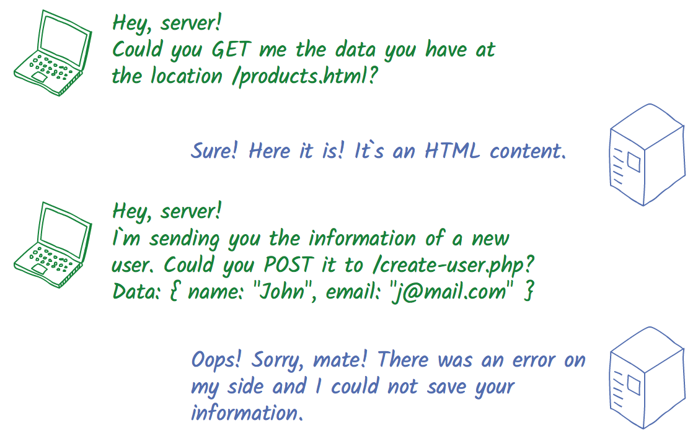
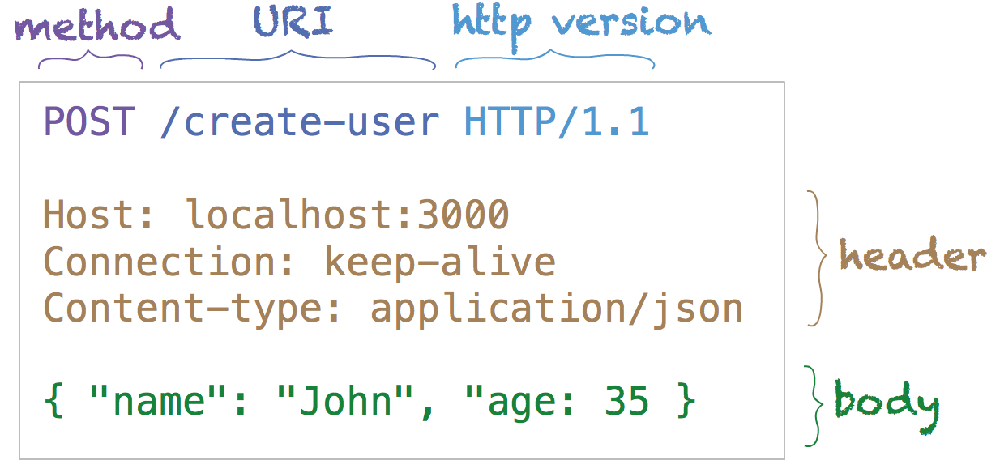
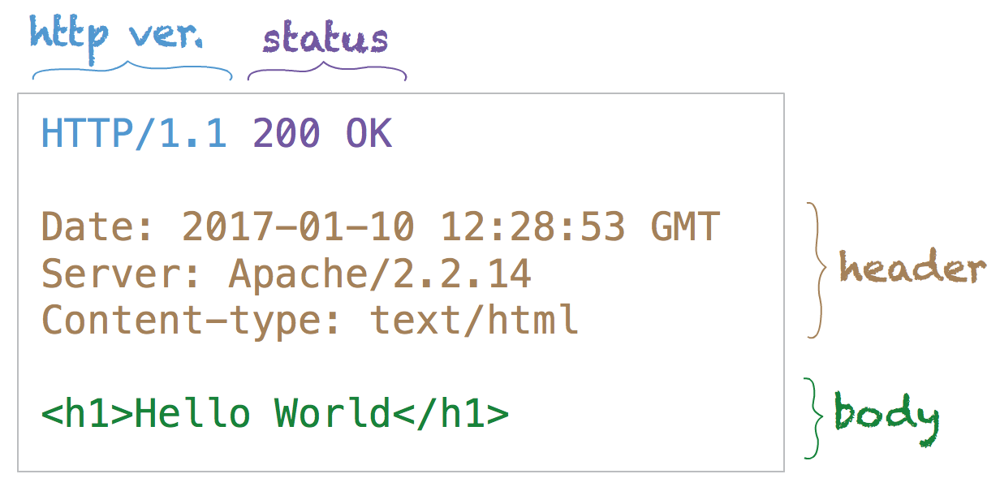

> [Ler em Português](../básico-de-http-para-desenvolvedores-frontend-954fa3688c87)

**HTTP **— Hypertext  Transfer Protocol — is how client and server (frontend and backend) talk to each other. As frontend developers (and web developers in general) we should understand at least the basics of this communication, because an important part of our job is to send _requests_ to the server and handle the _responses_.

## Request and response

Basically the way that communication works is by exchanging messages. The client sends a _request_ and the server sends back a _response_.



Client and server talking to each other.

## Anatomy of a request

An HTTP request is composed of the following parts:



Parts of an HTTP request.

### **Method**

Also referred as _verb_, is the kind of action to be performed (GET information, POST information back to the server, etc). The most common are:

*   **GET**  
    Retrieve information from the server. For example: a webpage, an image file.
*   **POST**  
    Send data to the server. For example: a filled registration form.
*   **PUT**  
    Send data to completely replace an existing resource.
*   **PATCH**  
    Send data to apply partial modifications to a resource.
*   **DELETE**  
    Delete the specific resource from the server.

### **URI**

Uniform Resource Identifier — is the path on the server that identify the information (the _resource_ to be fetched, created, modified).

### **Header**

Additional information about the request and about the client, in the form of key-value pairs.

### **Body**

Optional. The content the client sends to the server. GET and DELETE requests usually don’t need one. For POST, PUT and PATCH requests this is where the information to be created or modified is sent.

## Anatomy of a response

An HTTP response is composed of the following parts:



Parts of an HTTP response

### Status

Indicates, by a numeric code, whether a request has been successfully completed. They are grouped in five classes, identified by the first digit. Some of the most used statuses are:

*   **1xx — Information**
*   **2xx — Success  
    200 OK**: The request was completed successfully.
*   **3xx — Redirect**  
    **301 Moved Permanently**: The resource is permanently located in a different URI. A new URI should be given in the response.  
    **302 Found**: The resource temporarily moved to a new location.
*   **4xx — Client error**  
    **400 Bad Request**: The request could not be understood by the server.  
    **403 Forbidden**: User not authorized to perform the requested operation.  
    **404 Not Found**: The requested resource could not be found at the given URI.  
    **405 Method Not Allowed**: The request method is not allowed on the specified resource.
*   **5xx — Server error**  
    **500 Internal Server Error**: The server encountered an unexpected condition, preventing it to fulfill the request.  
    **503 Service Unavailable**: The server is temporarily unavailable, usually due to overloading or maintenance.

For a more comprehensive list:   
[http://www.restapitutorial.com/httpstatuscodes.html](http://www.restapitutorial.com/httpstatuscodes.html)

### Header

Like the request header, this contains additional information about the server and about the response itself.

### Body

Optional. This is the content returned by the server.


---

## Practical examples: HTTP requests with JavaScript

**Example #1**: GET information about the latest React release on GitHub

```js
// the request:
// GET information about the latest React release on GitHub
// we don't need to inform the method (GET is the default), 
//   headers or body (GET request doesn't need one)
fetch('https://api.github.com/repos/facebook/react/releases/latest') // the URI
  .then(response => {
    // we received the response and print the status code
    console.log(response.status)
    // return response body as JSON
    return response.json()
  })
  .then(json => {
    // print the JSON
    console.log(json)
  })

// on success will log:
// 200
// { ... contents of the response body as JSON ... }
```

**Example #2**: POST a new email to be associated to my GitHub account

```js
// the request:
// POST a new email address to my GitHub account
fetch('https://api.github.com/user/emails', { // the URI
  method: 'POST', // the method
  body: JSON.stringify(["octocat@github.com"]) // the body
})
  .then(response => {
    // we received the response and print the status code
    console.log(response.status)
    // return response body as JSON
    return response.json()
  })
  .then(json => {
    // print the JSON
    console.log(json)
  })

// on success will log:
// 201
// { ... contents of the response body as JSON ... }
```

**Example #3**: Handling a failed request (status code different than 2xx)

```js
// the request:
// try to GET an nonexistent URI
fetch('https://api.github.com/nonexistent-uri')
  .then(response => {
    if (response.ok) {
      // we should not reach here
      console.log('success')
    } else {
      console.log(response.status)
    }
  })

// will log:
// 404
```

## Additional resources

[https://developer.mozilla.org/en-US/docs/Web/HTTP](https://developer.mozilla.org/en-US/docs/Web/HTTP)  
 [https://pt.wikipedia.org/wiki/Hypertext\_Transfer\_Protocol](https://pt.wikipedia.org/wiki/Hypertext_Transfer_Protocol)  
 [https://www.tutorialspoint.com/http/index.htm](https://www.tutorialspoint.com/http/index.htm)  
 [https://developer.mozilla.org/en/docs/Web/API/Fetch\_API](https://developer.mozilla.org/en/docs/Web/API/Fetch_API)

Feedback? Suggestions?

See y’all!