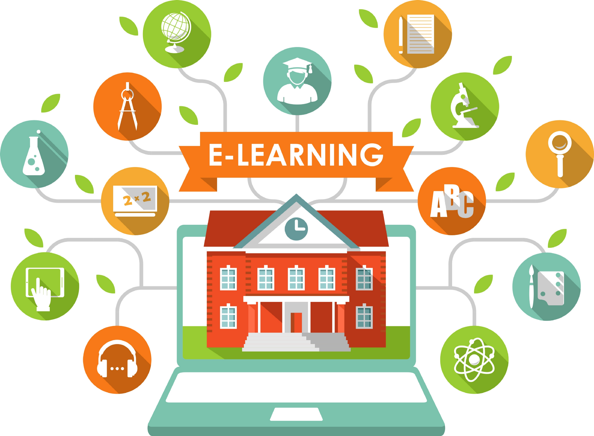
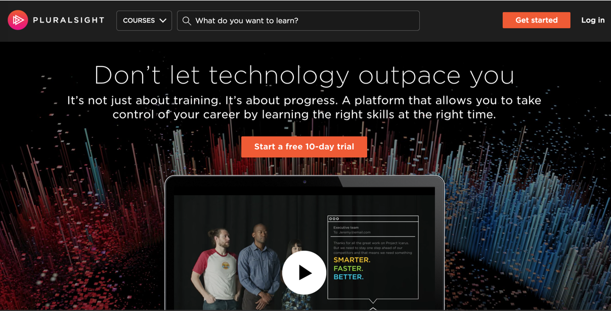
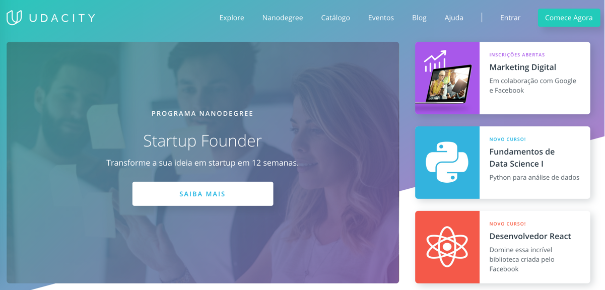
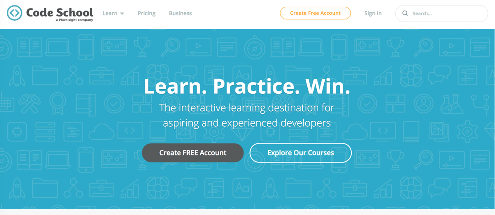

E aí, pessoal! Neste post eu vou listar os melhores sites de cursos online pra aprender programação (seja web, mobile, games, machine learning) e tudo mais relacionado a tecnologia. Tem muita coisa em português e também muita coisa gratuita.

## Os Top 5 🏆

Antes de listar todas as opções, acho justo elencar e detalhar mais as **5 melhores**, com base na minha experiência e nas opiniões que vejo nas comunidades.

## Udemy

🔗 [udemy.com](http://bit.ly/udemy-dmatoso)

Mais de 50.000 cursos em diversas áreas, como programação, design, negócios, artes, idiomas, etc.

**💵 Custo:** Preço varia por curso. Possui cursos gratuitos. 🎉  
🌎 **Idioma:** Vários, incluindo português 🇧🇷

**Prós:**

*   Frequentemente eles fazem promoções onde quase qualquer curso sai por R$20,00 ou R$30,00. Excelente custo-benefício!
*   Muitas opções de curso. Muitos autores renomados em suas áreas, com excelentes cursos.
*   Uma vez comprado, tem acesso vitalício ao curso, incluindo futuras atualizações que o autor fizer.

**Contras:**

*   Alguns cursos são de qualidade duvidosa, mas as notas e avaliações irão de alertar disso antes de comprar.

## Alura

🔗 [alura.com.br](http://www.alura.com.br)

Mais de 400 cursos de tecnologia, nas áreas de programação, design, infraestrutura, negócios. Todos em português!

**💵 Custo:** Valor anual (dividido em 12x) por curso ou valor único para acessar todos os cursos.  
🌎 **Idioma:** Português 🇧🇷

**Prós:**

*   Muitas opções de curso, todos com muita qualidade e todos em português.
*   Além dos vídeos das aulas, tem material complementar em texto, exercícios e projetos.
*   Organização dos cursos em carreiras ajuda a nortear os estudos.

**Contras:**

*   Não possui plano mensal. O compromisso anual pode ser pesado dependendo da sua situação financeira e de tempo.

## Pluralsight

🔗 [pluralsight.com](http://bit.ly/pluralsight-dmatoso)

Mais de 5000 cursos de tecnologia em áreas como desenvolvimento, infraestrutura e design e UX.

**💵 Custo:** Mensalidade para acessar todos os cursos. Pode experimentar grátis por 10 dias.  
🌎 **Idioma:** Inglês 🇺🇸

**Prós:**

*   Muitos cursos, com uma qualidade geral alta, a maioria criada por profissionais renomados.
*   Plataforma completa, com exercícios, “learning paths”, avaliações de desempenho.

**Contras:**

*   Apenas cursos em inglês.
*   Mensalidade em dólares acaba saindo cara pra brasileiros.

## Udacity

🔗 [udacity.com](https://br.udacity.com/)

Excelentes cursos gratuitos em diferentes áreas do desenvolvimento (web, mobile, machine learning). Muitos cursos são feitos em parceria com grandes empresas como Google, Facebook e AT&T. Tem bastante material em português.

Oferece o programa _Nanodegree_, que são cursos mais completos, onde você desenvolve projetos, é avaliado por especialistas e recebe uma certificação no final.

**💵 Custo:** Cursos gratuitos 🎉 (apenas o programa Nanodegree é pago)  
🌎 **Idioma:** Inglês e português 🇧🇷

## Code School

🔗 [codeschool.com](https://www.codeschool.com/)

Possivelmente os cursos com a melhor didática de toda a Internet. Os vídeos são objetivos e bem humorados, e após cada aula tem exercícios práticos que você faz no próprio navegador. Não possui uma quantidade tão grande de cursos quanto as outras escolas.

**💵 Custo:** Mensalidade para acessar todos os cursos. Possui cursos gratuitos. 🎉  
🌎 **Idioma:** Inglês 🇺🇸