Segue uma lista de alguns games e demonstrações que eu desenvolvi por hobby (alguns por necessidade) ao longo do tempo.

OBS. 2: São todos executáveis Windows (sorry, Linux and Mac people).

## Mr. Bean Cortando o Rabo do Macaco

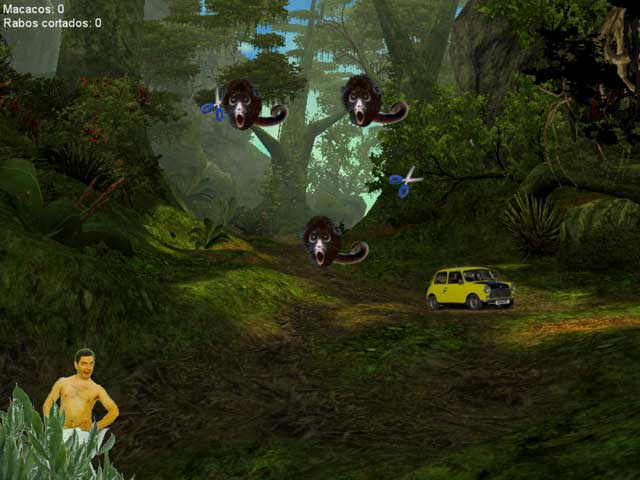

Joguinho feito em XNA para aprendizado.

**Download:** [mr\_bean\_cortando.rar](http://dmatoso.com/portfolio/files/mr_bean_cortando.rar) (1.60 MB)

## Boliche

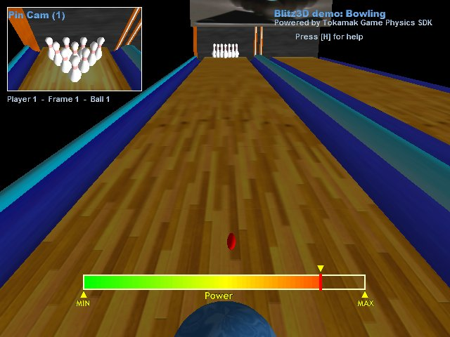

Desenvolvido com Blitz3D e a biblioteca de física Tokamak.

**Download:** [bowling\_demo\_v02.rar](http://dmatoso.com/portfolio/files/bowling_demo_v02.rar) (1.15 MB)

## Little Plane

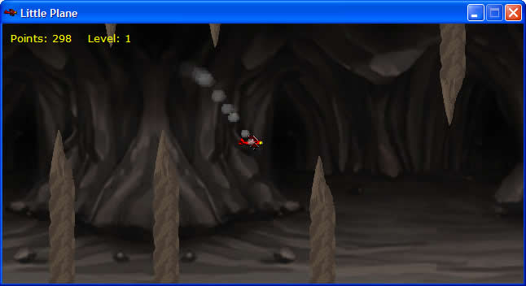

Game desenvolvido com o Game Maker.

**Download:** [littleplanev11b.rar](http://dmatoso.com/portfolio/files/littleplanev11b.rar) (0.84 MB)

**Visitar:** [http://dmatoso.com/littleplane](http://dmatoso.com/littleplane)

## Cena Urbana

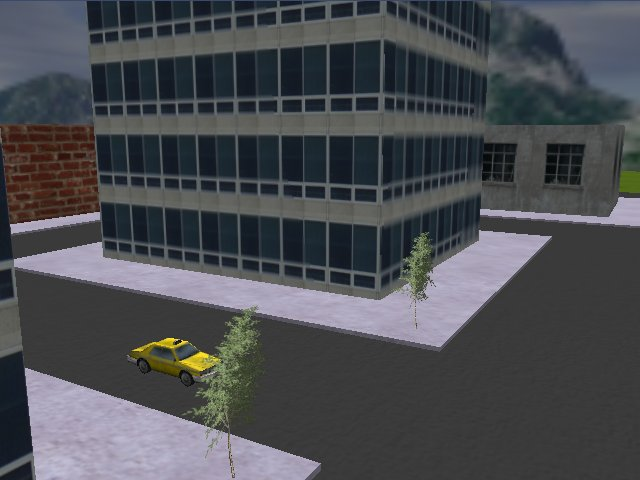

Trabalho desenvolvido para a disciplina de Computação Gráfica da universidade. Feito em C++ e OpenGL. (OBS.: Download temporariamente indisponível)

**Download:** [cena\_urbana.zip](http://dmatoso.com/portfolio/files/cena_urbana.zip) (0.00 MB)

## Demo FPS (Tiro em Primeira Pessoa)

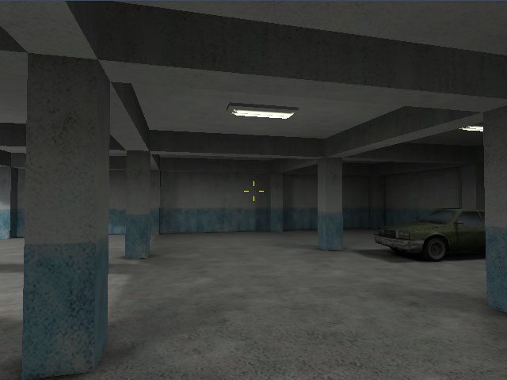

Demonstração de um jogo de tiro em primeira pessoa, feito em Blitz3D.

**Download:** [demo\_fps\_blitz3d.rar](http://dmatoso.com/portfolio/files/demo_fps_blitz3d.rar) (1.36 MB)

## Pong Max

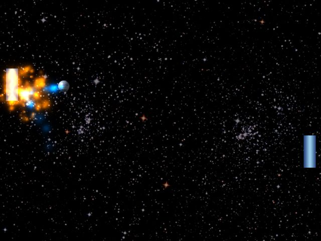

Demo de uma versão turbinada do clássico Pong, feita em BlitzMax.

**Download:** [pong\_max\_wip1.rar](http://dmatoso.com/portfolio/files/pong_max_wip1.rar) (0.55 MB)

## FutMesa 3D

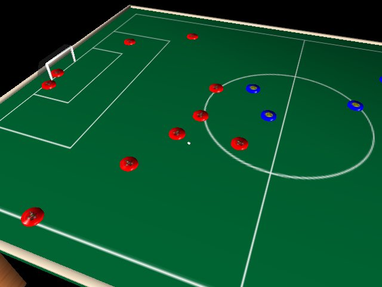

Desenvolvido com Blitz3D e a biblioteca de física Tokamak.

**Download:** [futmesa3d\_demo.rar](http://dmatoso.com/portfolio/files/futmesa3d_demo.rar) (1.19 MB)

## Tetris 3D

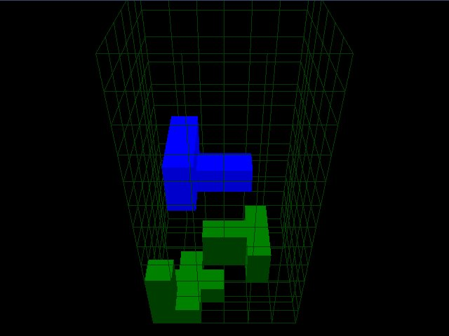

Trabalho desenvolvido para a disciplina de Computação Gráfica da universidade. Feito em C++ e OpenGL.

**Download:** [tetris3d.rar](http://dmatoso.com/portfolio/files/tetris3d.rar) (0.17 MB)

## Sinuca e Trigonometria

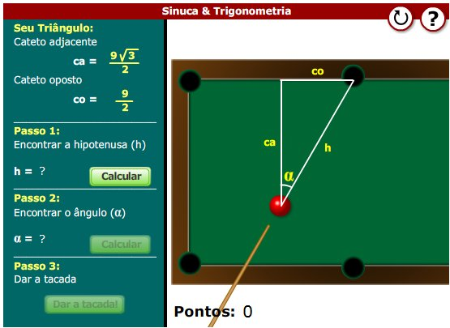

Objeto de Aprendizagem desenvolvido em Flash para a disciplina de Sistemas Interativos da universidade.

**Visitar:** [files/sinuca/sinuca.html](http://dmatoso.com/portfolio/files/sinuca/sinuca.html)

## Câmera em 3a. Pessoa

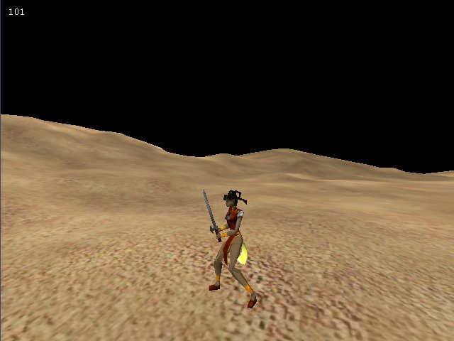

Teste de uma câmera em 3a. pessoa e personagem animado (formato MD2). Feito em Blitz3D.

**Download:** [exemplo\_3a\_pessoa.rar](http://dmatoso.com/portfolio/files/exemplo_3a_pessoa.rar) (0.92 MB)

## Cenário 2D

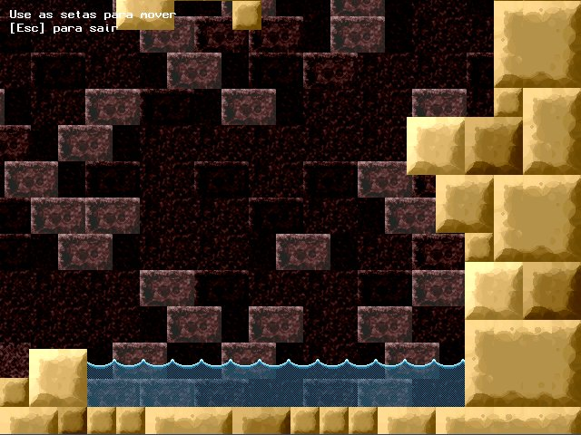

Carregamento de um cenário 2D feito em tiles com camadas de scroll. Cenário feito com o TileStudio e código em BlitzMax.

**Download:** [tilestudio\_bmax\_demo.zip](http://dmatoso.com/portfolio/files/tilestudio_bmax_demo.zip) (0.45 MB)

## Sistema de Partículas

Sistema de partículas desenvolvido em BlitzMax.

**Download:** [blitzmax\_particulas.rar](http://dmatoso.com/portfolio/files/blitzmax_particulas.rar) (0.17 MB)

## Sistema de Partículas (Fogo)

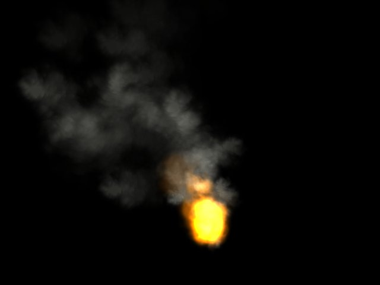

Continuação do sistema de partículas desenvolvido em BlitzMax, agora com exemplo de fogo.

**Download:** [blitzmax\_particulas\_fogo.rar](http://dmatoso.com/portfolio/files/blitzmax_particulas_fogo.rar) (0.31 MB)

## Relógio Analógico

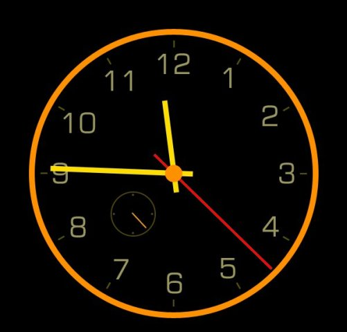

Relógio analógico feito em BlitzMax.

**Download:** [bmax\_clock.rar](http://dmatoso.com/portfolio/files/bmax_clock.rar) (0.14 MB)

## Links

*   [Blitz 3D / BlitzMax](http://www.blitzbasic.com/)
*   [XNA](http://create.msdn.com/)
*   [Game Maker](http://www.yoyogames.com/gamemaker)
*   [Tile Studio](http://tilestudio.sourceforge.net/)
*   [Tokamak Physics](http://www.tokamakphysics.com/)