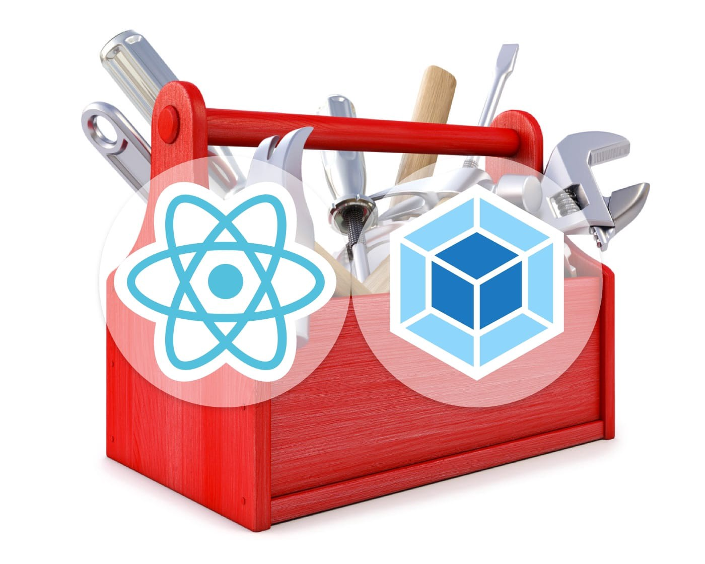

In this post I’ll show a minimal Webpack setup to start working with React.



**tl;dr**  
The final setup, with a sample component, can be found here: [https://github.com/doug2k1/react-minimal-setup](https://github.com/doug2k1/react-minimal-setup)

### What about create-react-app?

[create-react-app](https://github.com/facebookincubator/create-react-app) sure is the easiest way to start developing with React, but behind those friendly scripts lies a pretty complex setup, with lots of dependencies and configurations. Sooner or later you may have to eject from it, customize or build your own setup. So it’s important to understand what each dependency and config option does. And, for me, the best way to understand it is through baby steps. So let’s do the first one.

**Note:** I assume you have Node.js and NPM or Yarn installed.

## Dependencies

Our app dependencies are separate into two groups: **dependencies**, that are needed for the app execution by the end user, and **dev dependencies**, that are needed only during the development phase.

Before adding the dependencies we must initialize our _package.json_ file with `npm init -y`.

The only dependencies (non dev) we need are:

*   **react**: obviously
*   **react-dom**: to render our components on the page

They should be installed with the `--save` or `-S` flag:

```bash
npm i -S react react-dom
```

And the dev dependencies:

*   **webpack**: will pack our JS (and possibly other file types) into one, or more, bundles
*   **babel-core**: Babel will transform our code with JSX and ES2015 syntax to ES5, that is understandable by all browsers
*   **babel-loader**: the loader that plugs Babel with Webpack
*   **babel-preset-react**: Babel preset to enable JSX transformations
*   **babel-preset-es2015**: Babel preset to enable ES2015 transformations

They are installed with `--save-dev` or `-D`:

```bash
npm i -D webpack babel-core babel-loader babel-preset-react babel-preset-es2015
```

### About ES2015 (ES6)

Theoretically we could save one dependency and not use ES2015 features, but in order to create React components without it we would have to include another dependency: [create-react-class](https://facebook.github.io/react/docs/react-without-es6.html). Sou we would trade one dependency with another and lose all ES2015 goodness. It’s not worth it, unless you have a very specific reason to do so.

## Configuration

### Webpack

Our Webpack config (_webpack.config.js_) is as simple as this:

```js
const path = require('path')

module.exports = {
  entry: './src/index.js',

  output: {
    path: path.resolve('dist'),
    filename: 'bundle.js'
  },

  module: {
    rules: [
      {
        test: /\.js$/,
        loader: 'babel-loader'
      }
    ]
  }
}
```

It has an _entrypoint_ (the starting point of our app execution), an _output_ (where to save the bundled file, that will be executed by the browser) and one _loader_.

Our entry file uses react-dom to render our main component to the page body:

```jsx
import React from 'react'  
import ReactDOM from 'react-dom'  
import App from './App'

ReactDOM.render(<App />, document.getElementById('app'))
```

### Babel

The Babel loader will parse all files with .js extension and convert the JSX tags and ES2015 code to valid ES5. We need to enable these two transformations on the Babel config file (_.babelrc_), like this:

```json
{  
  "presets": \[ "es2015", "react" \]  
}
```

---

With this setup you can run the `webpack` command to build the _bundle.js_ file, or `webpack -w` to watch for modifications and rebuild the bundle on every file change.

To actually view the result in the browser, we need an _index.html_ file, like this:

```html
<!doctype html>  
<html>  
<head>  
  <title>React</title>  
</head>  
<body>  
  <div id="app"></div>  
  <script src="dist/bundle.js"></script>  
</body>  
</html>
```

You can check the complete setup at: [https://github.com/doug2k1/react-minimal-setup](https://github.com/doug2k1/react-minimal-setup)

See ya!