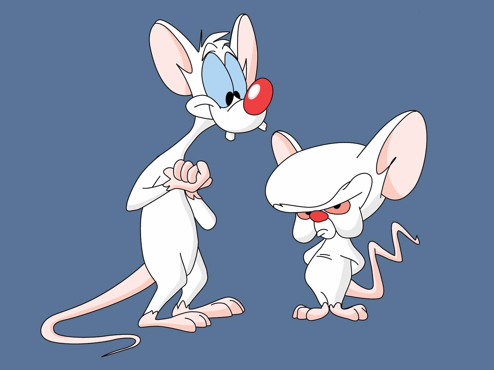

Componente burro (apresentação) e inteligente (container)

Neste post vou falar sobre dois tipos de componentes no [**React**](https://facebook.github.io/react/): **componentes container** e **componentes de apresentação**, e quais são as vantagens de fazer esta separação.

**OBS.:** Nos exemplos de código eu vou usar sintaxe **ES6**/**ES2015** (classes, arrow functions) e também vou omitir os _imports_ para simplificar.

## Componente normal

Um componente típico de **React** tem mais ou menos esta estrutura:

```js
class UserList extends React.Component {
  constructor () {
    super();
    this.state = {
      users: []
    };
  }

  componentDidMount () {
    fetch('/users').then(users => {
      this.setState({ users });
    });
  }

  render () {
    return (
      <ul>
        {this.state.users.map(user => <li key={user.id}>{user.name}</li>)}
      </ul>
    );
  }
}
```

Observe que ele cuida de duas coisas distintas: carregar os dados e apresentá-los. Por que isso é ruim? Imagine que você tem um componente que é uma lista de usuários (_UserList_, como no exemplo). Agora você quer exibir essa lista em partes diferentes da aplicação (ex.: lista de usuários logados, lista de usuários que são meus amigos, lista de usuários que mais participam), todas com a mesma cara, mas com dados vindos de fontes diferentes. O componente acima já não pode ser reusado.

Uma solução para isso é separar a parte de lógica, busca de dados, _state_, da parte da exibição.

## Componente de apresentação

Um componente de apresentação (_presentational component_), também chamado de componente “burro”, cuida apenas da parte do _render_. Todos os dados que ele precisa para fazer o render ele recebe via _props_. Ele deve tratar estes dados como imutáveis.

```js
class UserList extends React.Component {
  render () {
    return (
      <ul>
        {this.props.users.map(user => <li key={user.id}>{user.name}</li>)}
      </ul>
    );
  }
}
```

Veja que, para este componente não interessa de onde os dados vieram. Ele exibe o que ele recebe.

## Componente container

O que “sobrou” do componente original é o container (_container component_). Ele é a parte “inteligente”. Ele carrega os dados, manipula o _state_ e entrega tudo mastigado para o componente de apresentação exibí-los.

```js
class UserListContainer extends React.Component {
  constructor () {
    super();
    
    this.state = {
      users: []
    };
  }

  componentDidMount () {
    fetch('/users').then(users => {
      this.setState({ users });
    });
  }

  render () {
    return (
      <UserList users={this.state.users} />
    );
  }
}
```

Veja que o _render_ dele é bem simples, apenas delegando para o componente de apresentação e tarefa de exibir os dados.

Com isso as responsabilidades ficam mais separadas e você pode reusar o componente de apresentação com outras fontes de dados.

## Componentes funcionais sem estado

Como os componentes de apresentação só possuem basicamente o _render_, o **React** permite escrevê-los de forma mais enxuta, na forma de _stateless functional components_. Ao invés de ser uma classe, seu componente é apenas uma função (o próprio _render_), que recebe os _props_ e retorna o _JSX_.

```js
const UserList = (props) => {
  return (
    <ul>
      {props.users.map(user => <li key={user.id}>{user.name}</li>)}
    </ul>
  );
};
```

## Eventos

Uma dúvida que pode surgir é sobre os eventos. Eventos são registrados nos elementos da apresentação, mas eles trabalham com lógica e podem alterar o _state_, que é responsabilidade do container.

Para manter a separação você deve passar os possíveis _event handlers_ para a apresentação também na forma de props.

```js
// container
class UserListContainer extends React.Component {
  ...

  toggleActive (event) {
    // event logic
  }

  render () {
    return (
      <UserList users={this.state.users} toggleActive={this.toggleActive} />
    );
  }
}
```

```js
// apresentação
const UserList = (props) => {
  return (
    <ul>
      {props.users.map(user => {
        return (
          <li key={user.id}>
            <input type="checkbox" onChange={props.toggleActive} />
            {user.name}
          </li>
        );
      })}
    </ul>
  );
};
```

## MVC?

Fazendo uma comparação de leve com **MVC** (não vamos muito longe não, já que o **React** trabalha de forma diferente e tentar encaixá-lo no **MVC** pode confundir as coisas), os componentes de apresentação seriam como as **views**, e os containers algo mais próximos de **controllers**.

## Benefícios

Citando **Dan Abramov** no seu artigo [https://medium.com/@dan\_abramov/smart-and-dumb-components-7ca2f9a7c7d0](https://medium.com/@dan_abramov/smart-and-dumb-components-7ca2f9a7c7d0)

*   Melhor separação de responsabilidades. Você compreende seu app melhor fazendo essa separação.
*   Melhor reusabilidade. Você pode usar o mesmo componente de apresentação com diferentes fontes de dados.
*   Componentes de apresentação são basicamente a “paleta” do seu app. Você pode colocá-los em uma página e deixar seu designer ajustar suas variações, sem se preocupar com a lógica. Você pode executar testes de regressão visuais nesta página.
*   Ela te força a extrair “componentes de layout” como _Sidebar_, _Page_, _ContextMenu_ e usar _this.props.children_ ao invés de duplicar a mesma marcação em vários componentes container.

## Referências

*   [https://css-tricks.com/learning-react-container-components/](https://css-tricks.com/learning-react-container-components/)
*   [https://medium.com/@dan\_abramov/smart-and-dumb-components-7ca2f9a7c7d0](https://medium.com/@dan_abramov/smart-and-dumb-components-7ca2f9a7c7d0)
*   [https://medium.com/@learnreact/container-components-c0e67432e005](https://medium.com/@learnreact/container-components-c0e67432e005)
*   [https://facebook.github.io/react/blog/2015/10/07/react-v0.14.html#stateless-functional-components](https://facebook.github.io/react/blog/2015/10/07/react-v0.14.html#stateless-functional-components)