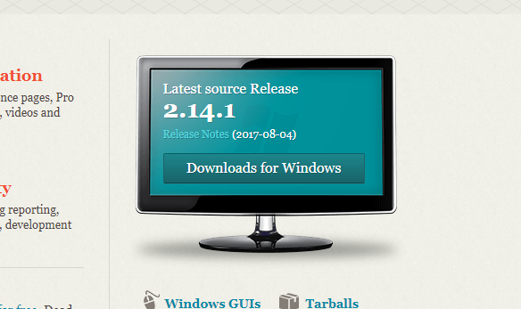
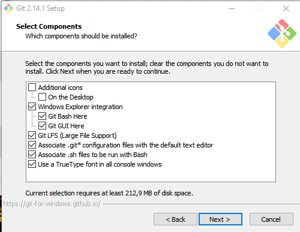
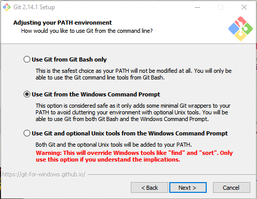
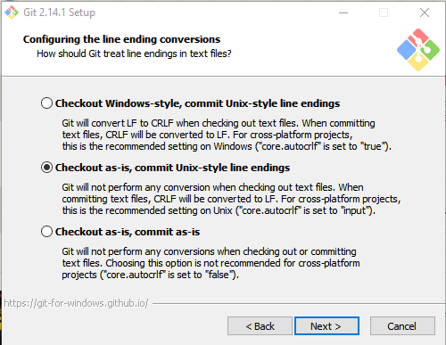
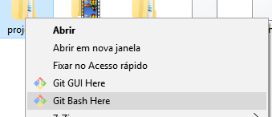
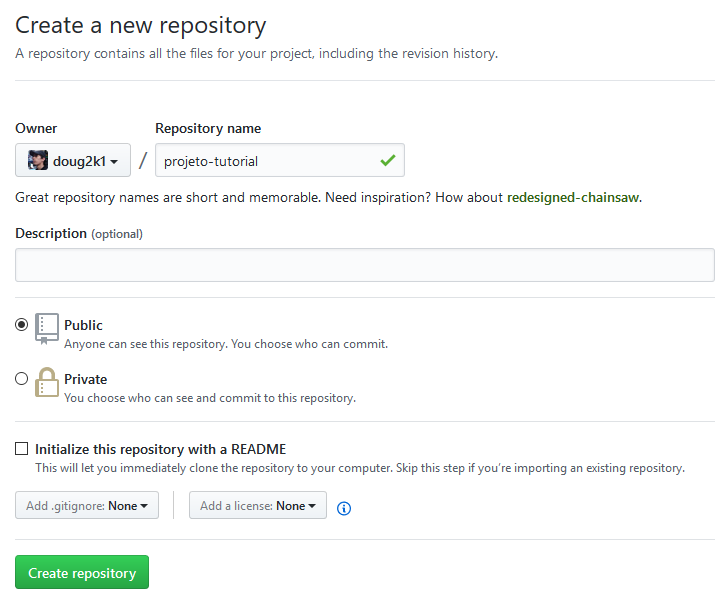
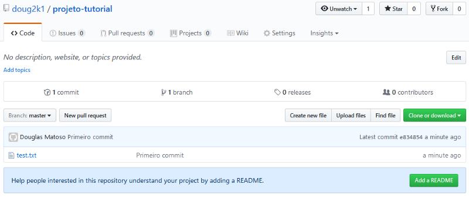

E ae, pessoal!

Tempinho sem postar, né? Bom, para colocar alguma atividade nesta bagaça vou fazer um tutorial simples para utilizar o [**Git**](http://git-scm.com/) no Windows e comitar seus códigos no [**GitHub**](http://www.github.com/).

> **Atualizado 2017**: Novos prints e atualização dos passos.

## 1) Instalando o Git para Windows

No site oficial do **Git** ([http://git-scm.com/](http://git-scm.com/)) clique em “**Downloads for Windows**”.

Execute o arquivo baixado e vá dando “**Next**” até a tela “**Select Components**”. Nesta tela eu escolho as opções como na imagem:

Em especial eu marco as opções em “**Windows Explorer integration**”, assim eu consigo abrir o prompt de comandos do Git (**Git Bash**) em qualquer pasta, basta clicar com o botão direito e “**Git Bash Here**”. A última opção também é interessante, porque ele instala uma fonte melhorzinha para o prompt de comandos.

**Nota:** O Git para Windows vem com um prompt de comandos próprio (o **Git Bash**), que além dos comandos git também fornece alguns comandos Unix que podem ser bem úteis (além de ser bem mais bonitinho que o prompt de comandos padrão do Windows).

Na próxima tela, eu escolho a opção: “**Use Git from the Windows Command Prompt**”.

Esta opção permite usar o comando `git` tanto no Git Bash quanto no terminal padrão do Windows.

A terceira adiciona comandos do Unix no terminal do Windows, além do próprio comando git, mas alguns comandos do Windows serão substituídos por comandos Unix que tem o mesmo nome (como find e sort).

Outra configuração importante: **quebra de linhas**.

Como deve saber Windows e sistemas Unix (Linux, Mac) possuem formatos diferentes de quebra de linha em arquivos texto. Se você escreve um código com quebras de linha no formato Windows, outra pessoa pode ter problemas ao abrir o mesmo arquivo em um Linux, e vice-versa. Esta opção permite normalizar isso.

A primeira opção converte os arquivos para padrão Windows quando os arquivos chegam para você, e convertem para padrão Unix quando você os comita no repositório. A segunda não faz nenhuma conversão quando os arquivos chegam, mas convertem para padrão Unix quando você comita. Já a terceira opção não faz nenhuma conversão.

Eu opto pela segunda, pois prefiro manter tudo no padrão Unix (já que qualquer bom editor de código consegue ler arquivos no padrão Unix mesmo estando em Windows).

Feito isso, “**Next**”, “**Finish**” e o Git está instalado. \\o/

## 2) Criando um repositório e comitando

Vamos testar? Crie uma pasta, botão direito nela e “**Git Bash Here**”.

Antes de mais nada, informe ao Git os seus dados, que irão identificar seus commits. Digite os comandos:

git config --global user.name "Nome Sobrenome"   
git config --global user.email "seu\_email@email.com"

**Dica:** para copiar e colar comandos no Git Bash, clique com o botão direito na tela do terminal.

Agora vamos inicializar um repositório Git nesta pasta que estamos.

git init

Viu esse (master) que apareceu na linha de comando? Ele indica que você está em um repositório Git, na branch master. Xique, hein?

Vamos adicionar um arquivo neste repositório que está vazio e comitá-lo. Veja a sequência de comandos:

touch teste.txt   
git add .   
git commit -m "Primeiro commit"

Primeiro criamos um arquivo **teste.txt** vazio. Depois adicionamos todos os novos arquivos (no caso só o teste.txt) ao índice do repositório, e por último comitamos todos os arquivos que estão no índice e foram modificados.

## 3) Compartilhando no GitHub

Legal, você tem um repositório Git na sua máquina, mas que tal compartilhar seus códigos no **GitHub** e usufruir de tudo que essa comunidade tem para oferecer?

## 3.1) Preparação Inicial

Vá em [https://github.com/](https://github.com/) e clique em “**Sign Up**” para criar sua conta gratuita.

Tendo cadastrado e logado em sua conta, agora você precisa de uma **chave SSH** para poder começar a comitar. No Git Bash digite:

ssh-keygen -t rsa -C "seu\_email@email.com"

Informe no comando seu e-mail cadastrado no **GitHub**. Dê Enter na próxima pergunta (sobre o arquivo a ser criado — vamos deixar o padrão).

A próxima pergunta vai te pedir uma senha (**passphrase**). Invente uma senha e a informe. Ele vai pedir uma confirmação. Digite a senha novamente e Enter. Digite agora:

notepad ~/.ssh/id\_rsa.pub

para abrir no Bloco de Notas o arquivo que foi criado.

Agora no **GitHub**, vá em “**Settings**” e depois “**SSH and GPG Keys**”. Clique “**New SSH key**”. Informe um título para identificar o computador onde a a chave foi gerada e no campo “Key” cole todo o conteúdo do arquivo **id\_rsa.pub** (que você abriu no Bloco de Notas)

Tome cuidado de copiar e colar todo o conteúdo do arquivo, começando por “ssh-rsa …” até o seu e-mail (incluindo ele, como na imagem). Clique em “**Add Key**”.

Vamos testar pra ver se essa bagaça deu certo. No Git Bash digite:

ssh -T git@github.com

Ele vai perguntar se você tem certeza que quer conectar bla bla bla (yes/no). Digite **yes** e Enter. Na próxima pergunta (Enter passphrase…) informe sua senha (a que você escolheu ao criar a chave SSH).

Se você receber uma mensagem do tipo:

Hi doug2k1! You've successfully authenticated, but GitHub does not provide shell access.

Então tudo deu certo!

## 3.2) Criando o primeiro repositório remoto

No **GitHub** vamos criar um novo repositório (botão “**New Repository**” no seu dashboard). Informe um nome sem espaços e caracteres especiais. As outras opções não precisa alterar.

Você cairá na página do seu repositório, que por enquanto ainda não tem arquivos.

**Importante!** Se o e-mail informado ao Git no início do **passo 2** não for o mesmo usado para se cadastrar no **GitHub**, refaça o comando informando o e-mail cadastrado. Assim o **GitHub** vai poder ligar os commits à sua conta.

No Git Bash (na pasta do seu repositório local) digite:

git remote add origin git@github.com:login/repositorio.git

Note que **login/repositorio** deve ser digitado como aparece na URL do seu repositório, no exemplo:

[https://github.com/**doug2k1/projeto-tutorial**](https://github.com/doug2k1/projeto-tutorial)

Agora para atualizar o **GitHub** com o que está no seu repositório local, digite:

git push -u origin master

Informe a sua senha (da chave SSH) quando pedido.

Recarregue a página do seu repositório e agora, ao invés da mensagem inicial, você verá seus commits e arquivos.

## 4) Conclusão

Apesar do Git ter se originado no Linux (Sabia que foi o Linus Torvalds que o criou?), a turma que usa Windows (seja porque gosta ou porque precisa) também pode se beneficiar com ele, graças ao Git for Windows. Além do próprio Git ser um excelente sistema de controle de versão, a comunidade open-source que popula o GitHub é vibrante. Tão gratificante quanto achar lá um código que “salva a sua pele” é poder contribuir com algum projeto, fazer _forks_, compartilhar.

Até a próxima!

## Recomendação de Cursos

[**Git e Github na Vida Real | Udemy**  
_Vamos dominar o Git e não ficar mais desesperados com conflitos e como trabalhar em equipe._click.linksynergy.com](https://click.linksynergy.com/deeplink?id=2tWLz9iuLxQ&mid=39197&murl=https%3A%2F%2Fwww.udemy.com%2Fgit-e-github-na-vida-real%2F "https://click.linksynergy.com/deeplink?id=2tWLz9iuLxQ&mid=39197&murl=https%3A%2F%2Fwww.udemy.com%2Fgit-e-github-na-vida-real%2F")

## Links

*   [Git — Site Oficial](http://git-scm.com/)
*   [GitHub](http://github.com/)
*   [Git no Wikipédia](http://pt.wikipedia.org/wiki/Git)
*   [Micro Tutorial de Git — AkitaOnRails](http://akitaonrails.com/2008/04/02/micro-tutorial-de-git)
*   [Minha página no GitHub](https://github.com/doug2k1)