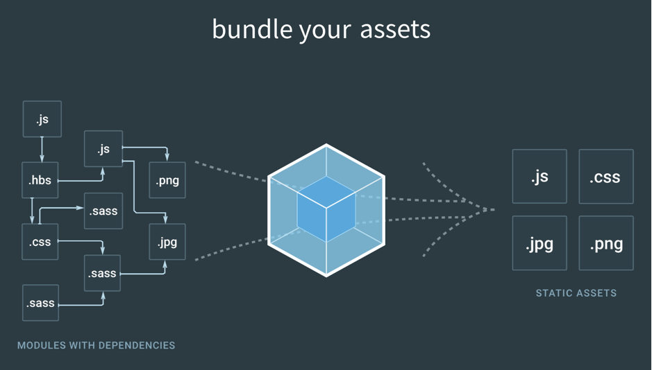
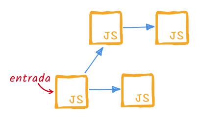

> Atualizado em **04/10/2018** para o **webpack 4**!

Esta série tem o objetivo de apresentar as funcionalidades do [**webpack**](https://webpack.js.org/)  de forma gradativa, explicando conceitos e mostrando exemplos.

> **Por que “sem medo”?**  
> Conheço algumas pessoas (incluindo eu mesmo) que tiveram um primeiro contato com **webpack**, não entenderam direito como usar, ficaram mais confusas ainda lendo a documentação e criaram uma aversão à ferramenta.  
> Muitas dessas pessoas tiveram contato com a versão 1 do **webpack**, que tinha uma configuração mais confusa e uma documentação menos organizada.  
> A boa notícia é que a partir da versão 2 isso mudou radicalmente. A configuração ficou mais fácil de compreender, e a documentação foi completamente reescrita, com excelentes guias, explicações claras e completas.  
> **Se tinha medo do webpack, a hora de perder o medo é essa!**

Mapa da série:

*   **1: Introdução** (você está aqui)
*   [2: Loaders](./webpack-sem-medo-parte-2-loaders-1d1239df3945)
*   [3: Plugins e Dev Server](./webpack-sem-medo-parte-3-plugins-e-dev-server-86b6e003657c)

## Mas o que é webpack?

Ilustração na home page do webpack

**webpack** é um _module bundler_ (empacotador de módulos) para JavaScript, em outras palavras, ele junta os arquivos JS (e também outros formatos) da sua aplicação (seja arquivos seus ou dependências externas) em um arquivo só (ou mais de um), de forma otimizada. Os arquivos são unificados na ordem certa, sem duplicação e podem ser minificados para reduzir o tamanho.

Um ponto forte do **webpack** que ele é altamente configurável e extensível através de plugins. Isso permite fazer algumas coisas interessantes como:

*   Utilizar **outros sabores de JS**, como ES6+, TypeScript, JSX e fazer a transpilação (conversão para ES5) automaticamente no processo de empacotamento.
*   Tratar e **empacotar outros tipos de arquivos**, como CSS (e variações como SASS, LESS, Stylus), SVG, imagens, arquivos de templates (Pug, Handlebars).
*   E muito mais, como veremos mais pra frente…

## Grafo de dependências

Como o **webpack** sabe quais arquivos incluir e em qual ordem? Ele monta um **grafo de dependências**, que é uma estrutura mais ou menos assim:

Grafo de dependências

Partindo de um arquivo inicial (entrada), ele verifica quais outros arquivos são importados por este, e os adiciona ao grafo. Para cada um desses ele também verifica quais eles importam, assim sucessivamente até que o grafo contenha todos os arquivos (módulos) necessários para a aplicação.

## Módulos

Para indicar que um arquivo JS depende de outro, ele precisa importá-lo. Ex.:

**import** React **from** 'react'**import** utils **from** './utils'

No exemplo acima ele importa uma dependência externa (**React**) e uma interna (o caminho começa com `./`). Note também que não é necessário informar a extensão do arquivo se for JS.

O arquivo que vai ser importado, em contrapartida, precisa indicar o que ele exporta. Ex.:

**const** utils = { ... }  
**export default** utils

Cada arquivo desses, que exporta algum dado ou funcionalidade, é chamado de **módulo**.

Dividir sua aplicação em módulos é uma boa prática, pelos seguintes benefícios:

*   **Manutenibilidade**: as funcionalidades ficam menos acopladas, é mais fácil alterar uma parte do código sem afetar o sistema inteiro.
*   **Isolamento**: variáveis e funções declaradas dentro de um módulo são acessíveis apenas dentro dele (exceto aquilo que o módulo explicitamente exporta), evitando conflitos de variáveis e acesso desnecessário de uma parte do código a outra não relacionada.
*   **Reusabilidade**: um módulo com uma funcionalidade bem definida, é como uma peça de lego, pode ser reutilizada em outras partes do mesmo sistema, ou em outros sistemas.
*   **Testabilidade**: com o código menos acoplado, fica mais fácil escrever testes unitários para validar cada funcionalidade.

A forma de fazer _import/export_ mostrada acima usa o padrão **ES Modules**, que é o adotado a partir do ES6 nos navegadores. O Node.js atualmente usa o padrão **CommonJS**, que muda um pouco a sintaxe:

**const** express = **require**('express')  
**const** utils = **require**('./utils')

**module.exports** = ...

Ambas as sintaxes são suportadas pelo webpack, mas aqui vamos usar **ES Modules**, que é o padrão no navegador, e está caminhando para se tornar o padrão no Node.js (veja referência \[8\]).

> **Leitura importante**  
> Recomendo se familiarizar com a sintaxe do **ES Modules**, e as diferentes formas de import/export. Veja referências \[5\], \[6\] e \[7\] ao final do artigo.

## Os 4 conceitos fundamentais do webpack

Antes de começar a colocar a mão na massa é importante compreender os **4 _core concepts_** do webpack: **entry**, **output**, **loaders** e **plugins**. Tendo estes conceitos em mente fica mais fácil entender como o webpack trabalha.

Ilustração dos 4 conceitos fundamentais do webpack

Nesta primeira parte vamos ver apenas os dois primeiros, que já serão suficientes para os primeiros exemplos. Veremos os outros quando forem necessários.

### Entry (entrada)

Lembra que eu falei lá em cima sobre o **grafo de dependências**, e que para montá-lo o webpack parte de um **arquivo inicial** e vai seguindo os _imports_? Pois é, este arquivo inicial é o _entry point_ (ponto de entrada) da aplicação.

Veremos que toda configuração de webpack possui pelo menos um _entry point_. Pode ter mais de um (nesse caso serão gerados mais de um grafo de dependências), mas vamos ver esses casos mais avançados em outro momento.

### Output (saída)

Uma vez montado o grafo de dependências, o webpack precisa saber onde ele vai salvar o arquivo unificado, ou vários arquivos, dependendo da configuração.