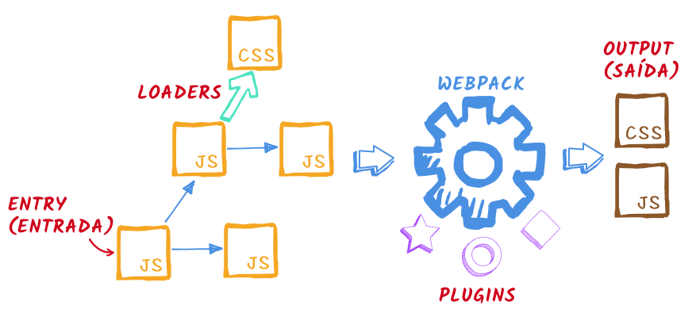

> Atualizado em **06/10/2018** para o **webpack 4** e **Babel 7**!

> Anteriormente em **Webpack sem Medo**…  
> Na [parte 1](./webpack-sem-medo-introducao-af889eb659e7) fizemos uma introdução, explicando alguns conceitos e mostramos o exemplo mais básico de uma configuração de webpack.

Nesta segunda parte vamos falar sobre o terceiro _core concept_ do webpack: **loaders**, e como podemos carregar diferentes tipos de arquivos. Este artigo vai ser menos teoria e mais prática.

Mapa da série:

*   [1: Introdução](./webpack-sem-medo-introducao-af889eb659e7)
*   **2: Loaders** (você está aqui)
*   [3: Plugins e Dev Server](./webpack-sem-medo-parte-3-plugins-e-dev-server-86b6e003657c)

## Loaders

O webpack, por padrão, entende apenas JS. Se você fizer, por exemplo, `**import** './styles.css'` e tentar rodar o webpack, ele vai reclamar:

ERROR in ./styles.css  
You may need an appropriate loader to handle this file type.

**Loaders** são módulos que são instalados separadamente e fazem a transformação do arquivo original para código JS. A forma como esta transformação é feita depende de cada loader. Loaders também podem ser usados para converter JS de uma versão para outra (por exemplo, ES6 para ES5).

Conceitos fundamentais do webpack (veja onde os loaders entram)

Com o conteúdo transformado em algo que o webpack compreende, ele consegue adicionar estes arquivos ao **grafo de dependências**.

Para dizer ao webpack qual loader ele deve usar em quais arquivos, adicionamos uma nova seção **module** no arquivo de configuração, que possui uma ou mais regras (**rules**).

**module**: {  
  **rules**: \[  
    // ...regras aqui  
  \]  
}

Cada regra vai ter um teste (**test**) para filtrar quais arquivos serão afetados por ela (normalmente pela pela extensão do arquivo, usando [expressão regular](https://developer.mozilla.org/pt-BR/docs/Web/JavaScript/Guide/Regular_Expressions)) e qual loader usar (**use**) para os arquivos que passarem pelo filtro.

module: {  
  rules: \[  
    {      
      **test**: /\\.css$/,  
      **use**: 'css-loader'  
    }  
  \]  
}

No exemplo acima estamos dizendo que todo arquivo que termina com **.css** deve passar pelo **css-loader**.

> **Explicando a expressão regular acima:**  
> as barras **/** … **/** indicam que o que está entre elas é uma expressão regular  
> **\\.** indica um ponto (é preciso esta barra invertida, pois sem ela o ponto tem outro significado em expressões regulares)  
> **css** significa o texto css mesmo  
> **$** significa final da string, ou seja, o valor .css deve estar no final do nome do arquivo

Vamos ver agora alguns exemplos de loaders, pra ficar mais claro.