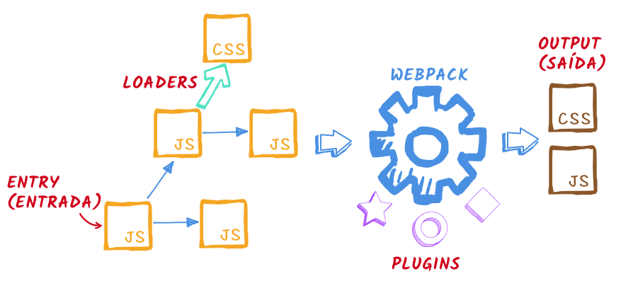

> Atualizado em **20/10/2018** para o **webpack 4**!

> Anteriormente em **Webpack sem Medo**…  
> Na [parte 1](./webpack-sem-medo-introducao-af889eb659e7) fizemos uma introdução, explicando alguns conceitos e mostramos o exemplo mais básico de uma configuração de webpack. Na [parte 2](./webpack-sem-medo-parte-2-loaders-1d1239df3945) falamos de **loaders**, para manipular diferentes tipos de arquivos.

Nesta terceira parte vamos falar sobre o quarto _core concept_ do webpack: **plugins**, que adicionam variadas funcionalidades ao processo de empacotamento. No final vamos falar também sobre **webpack-dev-server**, uma ferramenta muito útil durante o desenvolvimento com webpack.

Mapa da série:

*   [1: Introdução](./webpack-sem-medo-introducao-af889eb659e7)
*   [2: Loaders](./webpack-sem-medo-parte-2-loaders-1d1239df3945)
*   **3: Plugins e Dev Server** (você está aqui)

## Plugins

O webpack expõe _hooks_, pontos específicos do processo de empacotamento, onde plugins podem entrar e alterar o processo ou adicionar novas tarefas.

Alguns plugins já vem com o webpack, outros são instalados como módulos externos. (Veremos exemplos dos dois casos.)

No seu _webpack.config.js_ um plugin normalmente aparece em duas partes:

Se for um plugin externo, é preciso importá-lo no topo do arquivo:

**const MeuPlugin = require('meu-plugin')**

module.exports = { ... }

E na seção _plugins_, instanciá-lo usando `new`:

const MeuPlugin = require('meu-plugin')

module.exports = {  
  entry: ...,  
  output: ...,  
  module: ...,

  **plugins: \[new MeuPlugin()\]**  
}

_plugins_ é um array, pois você pode adicionar mais de um.

Normalmente o construtor recebe algumas opções, como veremos nos exemplos.